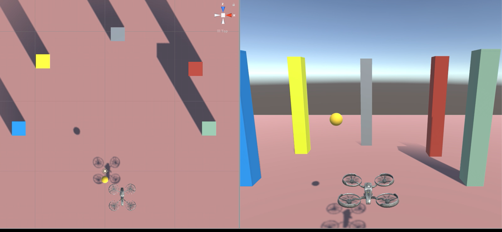

# AI-Drone
Training a drone to fly towards a target using Unity/ML-Agents/Reinforcement Learning.  

Credit to simeonradivoev for his drone model with PID, you can check out his repo here: https://github.com/simeonradivoev/Quadcopter-Controller 

I trained an agent to learn to fly this drone model, essentially substituting it as a human pilot. 

Unity Version: 2018.4.15f1  
ML-Agents: 0.13.1

Drone learns to fly and track moving targets. 

Check out the video demonstration here: https://youtu.be/E04FuH6EL8M

### *Agent Observations: * 
Throttle, pitch, roll, yaw, current distance to target, direction vector to the target, local posiiton of drone, drone velocity

### *Agent Actions: * 
Discrete actions: Thottle (up/down arrow keys), Roll(A/D keys), Yaw(left/right arrow keys), pitch(W/S keys)

### *Agent Rewards: 
The reward system was designed to reward the agent for moving closer to the target as well as reward it for yawing its head to the general direction of target. This was to ensure consistent flight paths. 

